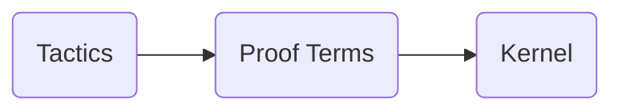

import Slide from '@/components/slides/Slide.astro'
import SlideImage from '@/components/slides/SlideImage.astro'
import shirogane from './images/shirogane.jpg'
import logictheorist from './images/logictheorist.jpg'
import fourcolor from './images/fourcolor.jpg'
import closepacking from './images/closepacking.jpg'
import ramanujan from './images/ramanujan.jpg'
import googleimo2025 from './images/googleimo2025.jpg'
import understandcode from './images/understandcode.jpg'
import unitdistance from './images/unitdistance.jpg'
import jacobianx from './images/jacobianx.jpg'
import openai10 from './images/openai10.jpg'
import voevodsky from './images/voevodsky.jpg'
import fregebook from './images/fregebook.jpg'

<Slide center>

# AI for Math and Lean

Malhar A. Patel

Press <kbd>→</kbd> to begin

</Slide>


<Slide>

## Navigation

- <kbd>←</kbd> / <kbd>→</kbd> — previous / next slide
- <kbd>Space</kbd> — next (<kbd>Shift</kbd>+<kbd>Space</kbd> — previous)
- <kbd>Home</kbd> / <kbd>End</kbd> — first / last slide
- <kbd>f</kbd> — toggle fullscreen
- Swipe left / right on touch devices

</Slide>


<Slide>

## Contents

1. The Current State of AI for Math
2. The Logical Structure of Math
3. Theorem Provers & Lean
4. Autoformalization and AI
5. AI for Math

</Slide>


<Slide center>

# The Good Old Days

Pre-2020 Computer Assisted Mathematics

</Slide>


<Slide>

## Computer-Assisted Math Before

<SlideImage src={shirogane} alt='img1' wrap align='right' width='40%' caption='' />

- Arithmetic Computations
- Computer Algebra Systems
- SAT/SMT/FOL/HOL Solvers
- Visualization Tools

<Fragment slot='refs'>

- Image. *Kaguya-sama: Love Is War* © Aka Akasaka/Shueisha, A-1 Pictures

</Fragment>

</Slide>


<Slide>

## Logic Theorist

<SlideImage src={logictheorist} alt='logictheorist' wrap align='right' width='40%' caption='Simon and Newell playing chess' />

- Considered the first "AI" program
- Developed by Allen Newell, Herbert Simon and Cliff Shaw
- Proved 38 of 52 theorems in Chapter 2 of *Principia Mathematica*

<Fragment slot='refs'>

1. The Logic Theory Machine: A Complex Information Processing System, Allen Newell, Herbert A. Simon, RAND paper P-868, July 12, 1956, revised.

- Image. http://shelf1.library.cmu.edu/IMLS/MindModels/problemsolving.html

</Fragment>

</Slide>


<Slide>

## Common Fixed Point Problem

<div class="theorem" style="border: 1px solid rgba(128, 128, 128, 0.4); border-radius: 20px; padding: 0px; margin: 15px 0; text-align: center;"> 
  For all continous $f, g: [0, 1] \to [0, 1]$, if $f$ and $g$ commute, 
  then there exists a common fixed point of $f$ and $g$ in $[0,1]$.
</div>

- One of the earliest examples of a computer-assisted proof (1967)
- Counterexample by William Boyce and John Huneke (independently)
- Boyce used a computer program to filter out 97% of cases

<Fragment slot='refs'>

1. Boyce, William M. (March 1969). "Commuting Functions with No Common Fixed Point". Transactions of the American Mathematical Society. 137: 77–92.

</Fragment>

</Slide>


<Slide>

## Four Color Theorem

<div class="theorem" style="border: 1px solid rgba(128, 128, 128, 0.4); border-radius: 20px; padding: 0px; margin: 15px 0; text-align: center;"> 
  For any loopless planar graph $G$, its chromatic number $\chi(G) \le 4$. 
</div>

<SlideImage src={fourcolor} alt='fourcolor' wrap align='right' width='25%' caption='' />

- Proven by Appel and Haken in 1976 with an enormous computer-aided proof
- Infeasible for humans to check by hand
- Formalized in Rocq by Gonthier in 2005

<Fragment slot='refs'>

1. Appel, Kenneth; Haken, Wolfgang (1989), Every Planar Map is Four-Colorable, Contemporary Mathematics, vol. 98

- Image. https://commons.wikimedia.org/w/index.php?curid=1680050

</Fragment>

</Slide>


<Slide>

## Kepler Conjecture

<div class="theorem" style="border: 1px solid rgba(128, 128, 128, 0.4); border-radius: 20px; padding: 0px; margin: 15px 0; text-align: center;"> 
  No packing of identical spheres in 3D has an average density 
  $> \frac{\pi}{3\sqrt{2}}$.
</div>

<SlideImage src={closepacking} alt='closepacking' wrap align='right' width='35%' caption='' />

- Proven by Thomas Hales in 1998 using a computer with a proof by exhaustion
- The end result was 3 GB in size
- Formalized in HOL and Isabelle in 2015

<Fragment slot='refs'>

1. Hales, Thomas C. (2005), "A proof of the Kepler conjecture", Annals of Mathematics, Second Series, 162 (3): 1065–1185

2. Hales, Thomas; et al. (9 January 2015). "A Formal Proof of the Kepler Conjecture"

- Image. https://commons.wikimedia.org/w/index.php?curid=33976435

</Fragment>

</Slide>


<Slide>

## Understanding the work

<SlideImage src={understandcode} alt='understandcode' wrap align='right' width='30%' caption='' />

In most of the previous cases, hopefully

- The **computer tools** are mathematically well understood, and generally deterministic
- Any **code** on top of that is well understood, since humans wrote it
- The overall **method** of arriving at the proof is well understood, since humans planned it out

All these are typically described in the papers.

</Slide>


<Slide>

## Appeals to Authority

> Mathematics is not about numbers, equations, computations, or algorithms: it is about understanding
>
> <cite style={{display: 'block', textAlign: 'right'}}>— William Thurston</cite>

> Young man, in mathematics you don't understand things, you just get used to them.
>
> <cite style={{display: 'block', textAlign: 'right'}}>— John von Neumann</cite>

</Slide>


<Slide center>

# The Present Days

Post-2020 Computer Assisted Mathematics

</Slide>


<Slide>

## Computer-Assisted Math Now

<SlideImage src={ramanujan} alt='ramanujan' wrap align='right' width='30%' caption='' />

- **AI (Frontier and Specialized Models)**
- **Interactive Theorem Provers**
- Arithmetic Computations
- Computer Algebra Systems
- SAT/SMT/FOL/HOL Solvers
- Visualization Tools

<Fragment slot='refs'>

- Image. Someone on [X](https://x.com)

</Fragment>

</Slide>


<Slide>

## Meme on "AI can't do addition"

- hah

<Fragment slot='refs'>

- Template

</Fragment>

</Slide>


<Slide>

## Early Signs

- [AlphaTensor](https://www.nature.com/articles/s41586-022-05172-4) discovers faster matrix multiplication algorithms via RL
- [FunSearch](https://www.nature.com/articles/s41586-023-06924-6) finds new cap set constructions via an LLM-based approach
- [AlphaProof and AlphaGeometry](https://deepmind.google/blog/ai-solves-imo-problems-at-silver-medal-level/) reach silver-medal level at IMO 2024 

<Fragment slot='refs'>

1. Fawzi, A., Balog, M., Huang, A. et al. Discovering faster matrix multiplication algorithms with reinforcement learning. Nature 610, 47–53 (2022).

2. Romera-Paredes, B., Barekatain, M., Novikov, A. et al. Mathematical discoveries from program search with LLMs. Nature 625, 468–475 (2024).

3. Hubert, T., Mehta, R., Sartran, L. et al. Olympiad-level formal mathematical reasoning with reinforcement learning. Nature 651, 607–613 (2026).

</Fragment>

</Slide>


<Slide>

## IMO 2025

<SlideImage src={googleimo2025} alt='googleimo2025' wrap align='right' width='50%' caption='' />

Gold-medal performance by
- [OpenAI](https://github.com/aw31/openai-imo-2025-proofs/), in natural language
- [Google](https://deepmind.google/blog/advanced-version-of-gemini-with-deep-think-officially-achieves-gold-medal-standard-at-the-international-mathematical-olympiad/), in natural language
- [Harmonic](https://github.com/harmonic-ai/IMO2025), in Lean

Silver-medal performance by
- ByteDance, in Lean

</Slide>


<Slide>

## Erdős's Unit Distance Conjecture

<div class="theorem" style="border: 1px solid rgba(128, 128, 128, 0.4); border-radius: 20px; padding: 0px; margin: 15px 0; text-align: center;"> 
  In a set of $n$ points, what could be the maximum number of pairs of points that are at unit distance from each other?
</div>

- Erdős conjectured that for all $\epsilon > 0, \ g(n) = \mathcal{O}(n^{1+\epsilon})$
- In 2026, a general-purpose **OpenAI** model constructed a counter-example using algebraic number theory 

<Fragment slot='refs'>

1. OpenAI. Planar Point Sets with Many Unit Distances (2026). https://cdn.openai.com/pdf/74c24085-19b0-4534-9c90-465b8e29ad73/unit-distance-proof.pdf

</Fragment>

</Slide>


<Slide>

<SlideImage src={unitdistance} alt='unitdistance' align='center' width='35rem' caption='Previously known constructions' />

<Fragment slot='refs'>

- Image. https://openai.com/index/model-disproves-discrete-geometry-conjecture/

</Fragment>

</Slide>


<Slide>

## Erdős's Unit Distance Conjecture

> In my opinion this paper demonstrates that current AI models go beyond just helpers to human mathematicians – they are capable of having original ingenious ideas, and then carrying them out to fruition.
>
> <cite style={{display: 'block', textAlign: 'right'}}>— Arul Shankar</cite>

> It is definitely an intimidating construction to see through even if you know what is going on, and even harder to go play for yourself.
>
> <cite style={{display: 'block', textAlign: 'right'}}>— Jacob Tsimerman</cite>

</Slide>


<Slide>

## Jacobian Conjecture

<div class="theorem" style="border: 1px solid rgba(128, 128, 128, 0.4); border-radius: 20px; padding: 0px; margin: 15px 0; text-align: center;"> 
  Let $F: \mathbb{C}^n \rightarrow \mathbb{C}^n$ be a polynomial map in $n$ complex variables, whose Jacobian $\det DF$ is a non-zero constant. Then $F$ is invertible.
</div>

<SlideImage src={jacobianx} alt='jacobianx' align='center' width='45rem' caption='' />

</Slide>


<Slide>

## Non-Sofic Groups

<div class="theorem" style="border: 1px solid rgba(128, 128, 128, 0.4); border-radius: 20px; padding: 0px; margin: 15px 0; text-align: center;"> 
  Does there exist a non-sofic group?
</div>

<SlideImage src={openai10} alt='openai10' align='center' width='50rem' caption='' />

- OpenAI's Astra showed that $L_{\mathbb{F}_2}(1,2)^{\times}$ is a non-sofic group

<Fragment slot='refs'>

1. OpenAI. Ten Advances in Mathematics and Theoretical Computer Science. https://cdn.openai.com/pdf/ten-proofs-oai.pdf

</Fragment>

</Slide>


<Slide>

## Template

<SlideImage src={ramanujan} alt='ramanujan' wrap align='right' width='30%' caption='' />

- Template

<Fragment slot='refs'>

- Template.

</Fragment>

</Slide>


<Slide>

## Foundations of Math

<SlideImage src={fregebook} alt='fregebook' wrap align='right' width='30%' caption="Frege's Begriffsschrift" />

The late 19th century:

- Cantor had created set theory
- Peano was formalizing arithmetic
- Frege was trying to derive arithemtic from logic
- Hilbert was pushing the axiomatic method

<Fragment slot='refs'>

- Template.

</Fragment>

</Slide>


<Slide>

## Russell's Paradox

<div class="theorem" style="border: 1px solid rgba(128, 128, 128, 0.4); border-radius: 20px; padding: 0px; margin: 15px 0; text-align: center;"> 
  If $R = \{x : x \notin x\}$, then does $R \in R$ ?
</div>

<SlideImage src={ramanujan} alt='ramanujan' wrap align='right' width='20%' caption='' />

- Russell found this paradox in Frege's work
- Logic allowed objects to apply to themselves too freely
- The problem, according to Russell, was **unrestricted self-application**

<Fragment slot='refs'>

- Template.

</Fragment>

</Slide>


<Slide>

## Russell's Theory of Types

<SlideImage src={ramanujan} alt='ramanujan' wrap align='right' width='30%' caption='' />

- Russell introduced type theory to restrict the kinds of applications possible in logic
- His system of the **ramified theory of types** resolved the paradoxes
- The problem was that it made ordinary mathematics painful and awkward to do

<Fragment slot='refs'>

- Template.

</Fragment>

</Slide>


<Slide>

## Simple Type Theory

<SlideImage src={ramanujan} alt='ramanujan' wrap align='right' width='30%' caption='' />

- Frank Ramsey argued that not all of Russell's ramified type theory was necessary for ordinary math
- Ramsey and Chwistek simplified a lot of Russell's type theory to get **simple type theory**

<Fragment slot='refs'>

- Template.

</Fragment>

</Slide>


<Slide>

## Church's Lambda Calculus

<SlideImage src={ramanujan} alt='ramanujan' wrap align='right' width='30%' caption='' />

The **untyped lambda calculus** had very simple syntax: 

- variables ($x$)
- function abstraction ($\lambda x.t$) 
- function application ($t u$)

The Kleene-Rosser Paradox showed that the lambda calculus was inconsistent, since it allowed unrestricted self-reference (like $xx$)

<Fragment slot='refs'>

- Template.

</Fragment>

</Slide>


<Slide>

## Simply Typed Lambda Calculus

<SlideImage src={ramanujan} alt='ramanujan' wrap align='right' width='30%' caption='' />

Church's 1940 paper “A Formulation of the Simple Theory of Types” combined lambda calculus with simple type theory.

Now, for $(xx)$ to be possible, it would require $(x : A \to B)$ and $(x : A)$ at the same time.

He also showed that the simply typed lambda calculus was **equivalent** to higher-order logic.

<Fragment slot='refs'>

- Template.

</Fragment>

</Slide>


<Slide>

## Gentzen's work on proof theory

<SlideImage src={ramanujan} alt='ramanujan' wrap align='right' width='30%' caption='' />

Gentzen introduced **natural deduction** and **sequent calculus**.

This aligned much more with how mathematicians actually did math, as compared to the axiomatic Hilbert-style systems.

If you have separately proven $A$ and $A \to B$, then you can infer $B$

<Fragment slot='refs'>

- Template.

</Fragment>

</Slide>


<Slide>

## Curry - Howard - de Bruijn Correspondence

|**Logic**|**Program**|
|:---:|:---:|
|Propositions|Types|
|$A \land B$|$A \times B$|
|$A \lor B$|$A + B$|
|$A \to B$|$A \to B$|
|$\forall x:A,\; B(x)$|$(x : A) \to B(x)$|
|$\exists x:A,\; B(x)$|$(x : A) \times B(x)$|

</Slide>


<Slide>

## Brouwer-Heyting-Kolmogorov Interpretation

The Curry-Howard correspondence aligns itself with intuitionistic logic, making proofs constructive.

They interpret:

- $A \lor B$ as a disjunction of either a proof of $A$ or a proof of $B$
- $\exists x, P(x)$ as a pair $(x,P(x))$, which involves constructing such an $x$

Classical mathematics involves non-constructive elements such as the Law of the Excluded Middle $(A \lor \neg A)$ and the Axiom of Choice.


<Fragment slot='refs'>

- Template.

</Fragment>

</Slide>


<Slide>

## Automath

<SlideImage src={ramanujan} alt='ramanujan' wrap align='right' width='30%' caption='' />

In 1967, Nicolaas de Bruijn started Automath.

- Proofs were explicit objects
- Proof checking was type checking
- Definitions would be unfolded
- The system rests on a small trusted kernel

Jutting translated Landau's Foundations of Analysis into Automath and checked its correctness

<Fragment slot='refs'>

- Template.

</Fragment>

</Slide>


<Slide>

## Tactics

<SlideImage src={ramanujan} alt='ramanujan' wrap align='right' width='30%' caption='' />

The LCF (Logic of Computable Functions) Theorem Prover was developed by Robin Milner based on Dana Scott's ideas.

Writing proof terms directly was difficult, so it introduced **tactics** to make this easier.

This is safe because errors at the tactic stage do not endanger soundness, since every proof term still has to pass through the trusted kernel.



<Fragment slot='refs'>

- Template.

</Fragment>

</Slide>


<Slide>

## More developments in Type Theory

- Per Martin-Löf made several contributions, including introducing **dependent types** in his **intuitionistic type theory** to create a constructive foundation of math and creating an infinite universe of types to avoid Girard's paradox (when `Type : Type`)
- Thierry Coquand and Gérard Huet developed the **Calculus of Inductive Constructions**, which is used in proof assistants like Rocq and Lean
- Classical (non-constructive) math can be checked in certain proof assistants by adding the Axiom of Choice (LEM can be proven from Choice via Diaconescu's Theorem)

</Slide>


<Slide>

## Barendregt's Lambda Cube

<SlideImage src={ramanujan} alt='ramanujan' wrap align='right' width='30%' caption='' />

- Template

<Fragment slot='refs'>

- Template.

</Fragment>

</Slide>


<Slide>

## More Proof Assistants

<SlideImage src={ramanujan} alt='ramanujan' wrap align='right' width='30%' caption='' />

Several proof assistants started being developed:

- HOL Family
- Mizar
- Isabelle
- Idris
- Agda
- Rocq

<Fragment slot='refs'>

- Template.

</Fragment>

</Slide>


<Slide>

## Template

<SlideImage src={ramanujan} alt='ramanujan' wrap align='right' width='30%' caption='' />

- Template

<Fragment slot='refs'>

- Template.

</Fragment>

</Slide>


<Slide>

## Template

<SlideImage src={ramanujan} alt='ramanujan' wrap align='right' width='30%' caption='' />

- Template

<Fragment slot='refs'>

- Template.

</Fragment>

</Slide>


<Slide>

## Voevodsky's Experience

<SlideImage src={voevodsky} alt='voevodsky' wrap align='right' width='30%' caption='' />

- In 1990, Voevodsky and Kapranov published “∞-groupoids as a model for a homotopy category”
- It claimed to provide a formulation and proof of Grothendieck's idea of connecting ∞-groupoids and homotopy types
- They decided to apply these ideas to develop motivic cohomology

<Fragment slot='refs'>

1. Kapranov, M. M., & Voevodsky, V. A. (1990). ∞-groupoids as a model for a homotopy category. Russian Mathematical Surveys, 45(5), 239–240.

</Fragment>

</Slide>


<Slide>

## Voevodsky's Experience

<SlideImage src={voevodsky} alt='voevodsky' wrap align='right' width='30%' caption='' />

- Previously in 1986, Spencer Bloch published “Algebraic Cycles and Higher K-theory”
- It was groundbreaking for motivic cohomology
- Unfortunately, Andrei Suslin found a mistake in Lemma 1.1, and it could not be fixed

<Fragment slot='refs'>

- Template.

</Fragment>

</Slide>


<Slide>

## Voevodsky's Experience

<SlideImage src={voevodsky} alt='voevodsky' wrap align='right' width='30%' caption='' />

- In 1993, Voevodsky, Suslin and Friedlander took a new approach in “Cohomological Theory of Presheaves with Transfers” 
- While giving lectures at the IAS in 1999, Voevodsky and Deligne discovered a mistake in a key lemma in the paper

<Fragment slot='refs'>

- Template.

</Fragment>

</Slide>


<Slide>

## Voevodsky's Experience

> This story got me scared. Starting from 1993, multiple groups of mathematicians studied my paper at seminars and used it in their work and none of them noticed the mistake. ... A technical argument by a trusted author, which is hard to check and looks similar to arguments known to be correct, is hardly ever checked in detail.
>
> <cite style={{display: 'block', textAlign: 'right'}}>— Vladimir Voevodsky</cite>

<Fragment slot='refs'>

- Template.

</Fragment>

</Slide>


<Slide>

## Voevodsky's Experience

<SlideImage src={voevodsky} alt='voevodsky' wrap align='right' width='30%' caption='' />

- In 1998, Carlos Simpson published “Homotopy types of strict 3-groupoids” 
- It contradicted the main result of Voevodsky and Kapranov's “∞-groupoids as a model for a homotopy category”
- Voevodsky could not find the mistake till 2013

<Fragment slot='refs'>

- Template.

</Fragment>

</Slide>


<Slide>

## Voevodsky's Experience

> It soon became clear that the only real long-term solution to the problems that I encountered is to start using computers in the verification of mathematical reasoning. Among mathematicians computer proof verification was almost a forbidden subject. A conversation ... would invariably drift to the Goedel Incompleteness Theorem (which has nothing to do with the actual problem).
>
> <cite style={{display: 'block', textAlign: 'right'}}>— Vladimir Voevodsky</cite>

<Fragment slot='refs'>

- Template.

</Fragment>

</Slide>


<Slide>

## Univalent Foundations of Math

<SlideImage src={voevodsky} alt='voevodsky' wrap align='right' width='30%' caption='' />

Voevodsky and other mathematicians started working on Homotopy Type Theory and Univalent Foundations of Math.

Types become spaces, terms become points, equalities become paths, and equalities of equalities become homotopies between paths.

<Fragment slot='refs'>

- Template.

</Fragment>

</Slide>


<Slide>

## Voevodsky's Experience

> I now do my mathematics with a proof assistant and do not have to worry all the time about mistakes in my arguments or about how to convince others that my arguments are correct. Sooner or later computer proof assistants will become the norm, but the longer this process takes the more misery associated with mistakes and with unnecessary self-verification the practitioners of the field will have to endure.
>
> <cite style={{display: 'block', textAlign: 'right'}}>— Vladimir Voevodsky</cite>

<Fragment slot='refs'>

- Template.

</Fragment>

</Slide>


<Slide>

## Template

<SlideImage src={ramanujan} alt='ramanujan' wrap align='right' width='30%' caption='' />

- Template

<Fragment slot='refs'>

- Template.

</Fragment>

</Slide>


<Slide>

## Lean

<SlideImage src={ramanujan} alt='ramanujan' wrap align='right' width='30%' caption='' />

- Template

<Fragment slot='refs'>

- Template.

</Fragment>

</Slide>


<Slide>

## Template

<SlideImage src={ramanujan} alt='ramanujan' wrap align='right' width='30%' caption='' />

- Template

<Fragment slot='refs'>

- Template.

</Fragment>

</Slide>


<Slide>

## Template

<SlideImage src={ramanujan} alt='ramanujan' wrap align='right' width='30%' caption='' />

- Template

<Fragment slot='refs'>

- Template.

</Fragment>

</Slide>


<Slide>

## Broad Themes: New Connections

- A lot of AI discoveries involve combining existing techniques from different math fields, rather than inventing fundmentally new methods

<Fragment slot='refs'>

- Template.

</Fragment>

</Slide>


<Slide>

## Template

<SlideImage src={ramanujan} alt='ramanujan' wrap align='right' width='30%' caption='' />

- Template

<Fragment slot='refs'>

- Template.

</Fragment>

</Slide>


<Slide>

## Code works

```lean title="Hello.lean"
def hello : String := "Hello, slides!"

theorem hello_nonempty : hello ≠ "" := by
  decide
```

Syntax highlighting uses the site's existing Shiki setup.

</Slide>


<Slide center>

# Thanks!

[Back to the site](/)

</Slide>


